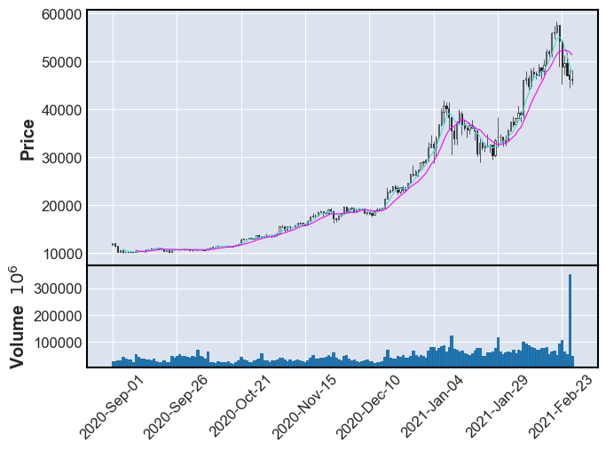
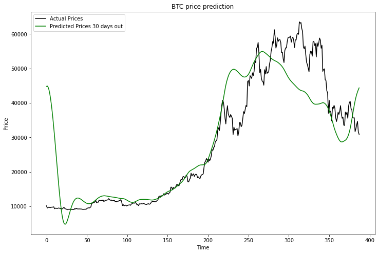

# Crypto Price Analysis
An exploration of various price forecasting algorithms applied to multiple cryptocurrencies.

## Data
We sourced historical crypto price data as CSVs from a Kaggle repository [Cryptocurrency Historical Prices](https://www.kaggle.com/sudalairajkumar/cryptocurrencypricehistory). This data was, in turn, sourced from [CoinMarketCap](https://coinmarketcap.com/). These CSVs are stored in the [resources/prices](resources/prices) directory. The information recorded in this dataset ran from each currency's initial trading date through the end of February, 2021. It included values for standard market trading data, such as:
- Date : date of observation
- Open : Opening price on the given day
- High : Highest price on the given day
- Low : Lowest price on the given day
- Close : Closing price on the given day
- Volume : Volume of transactions on the given day
- Market Cap : Market capitalization in USD

While this was sufficient for most historical analysis, it did not provide up-to-date market data. For analysis of current data we used Pandas-DataReader to pull data from the Yahoo Finance API. There is a duplicate notebook version of each currency analysis using both data sources.

A sort of 'metadata' file was created, [coin_types.csv](resources/coin_types.csv), that collects data about each cryptocurrency for which there was a CSV file in the original dataset. This data was collected from a variety of sites, and the sources of that data was recorded in [sources.txt](notes/sources.txt).

## Code
The initial code for analysis of the individual cryptocurrencies was repurposed from a Kaggle notebook associated with the original dataset, [Simple Exploration Notebook - Cryptocurrencies](https://www.kaggle.com/sudalairajkumar/simple-exploration-notebook-cryptocurrencies). The original code was four years old and some of the libraries or modules were no longer supported or had dependency conflicts. More current alternatives were found for tools such as the candlestick chart. This was also fleshed out to display moving-average trend lines for 5-day and 10-day periods, as well as trading volume for the period charted.

Future price prediction is performed with [fbprophet](https://facebook.github.io/prophet/), an open source forecasting tool developed by Facebook for Python and R. Due to market volatility for most cryptocurrencies, I chose to base forecasts on just the last 12 months of data. As implemented, Prophet detects price change trends based on 'day of week', 'day of year' (if multiple years of data are provided), or based on potential 'holiday effects' (based on specified country, if there is a correlation between holidays and value changes). The forecasting model also attempts, with varying degrees of success, to project the rough trending direction of future prices.

Since it analyzed multiple cryptocurrencies simultaneously, the correlation heatmap from this same notebook, analyzing data from the CSV files, was broken-out into its own [notebook](preprocessing/by_coin/coin_price_correlation_chart.ipynb). Though all the included CSV files are listed in the code, data for stable coins was commented out, as their prices don't fluctuate in relation to USD($) like other coin values. Additionally data for Crypto.com Coin is commented out of the analysis, because their correlation is so negative it makes it difficult to see correlation values between other coins.

Code was adapted from a YouTube video [Predicting Crypto Prices in Python](https://youtu.be/GFSiL6zEZF0) for the [crypto_price_prediction](preprocessing/experimentation/crypto_price_prediction.ipynb) notebook. This notebook sources data from the Yahoo Finance API and uses SciKit-Learn as well as Tensorflow to create a neural network. Its goal is to build a price-prediction model based on historical prices, as well as to predict next-day cryptocurrency prices.

Another video on the same YouTube channel as above, [Analyzing Cryptocurrencies in Python](https://youtu.be/HqGlkACB3rg), was also the primary code source for the [cryptocurrency_correlation_analysis_from_yahoo](preprocessing/experimentation/cryptocurrency_correlation_analysis_from_yahoo.ipynb) notebook. This notebook is another correlation comparison analysis of multiple cryptocurrencies. However, this time prices are pulled from the Yahoo Finance API instead of the CSV files. A price chart is drawn out (in logarithmic scale) to compare historical price changes amongst various coins. Another heatmat also shows correlation between various coins.

## Results